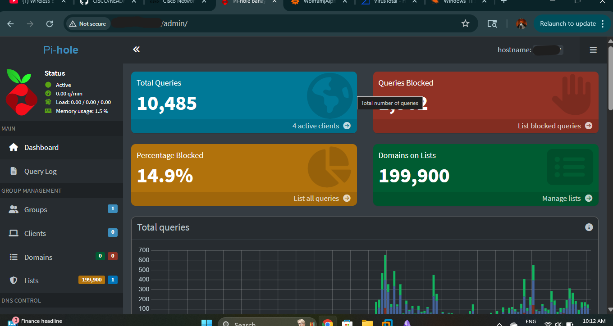
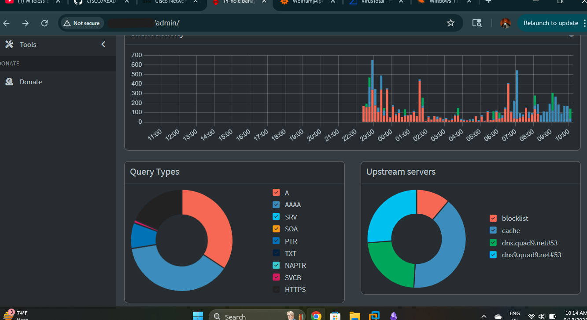
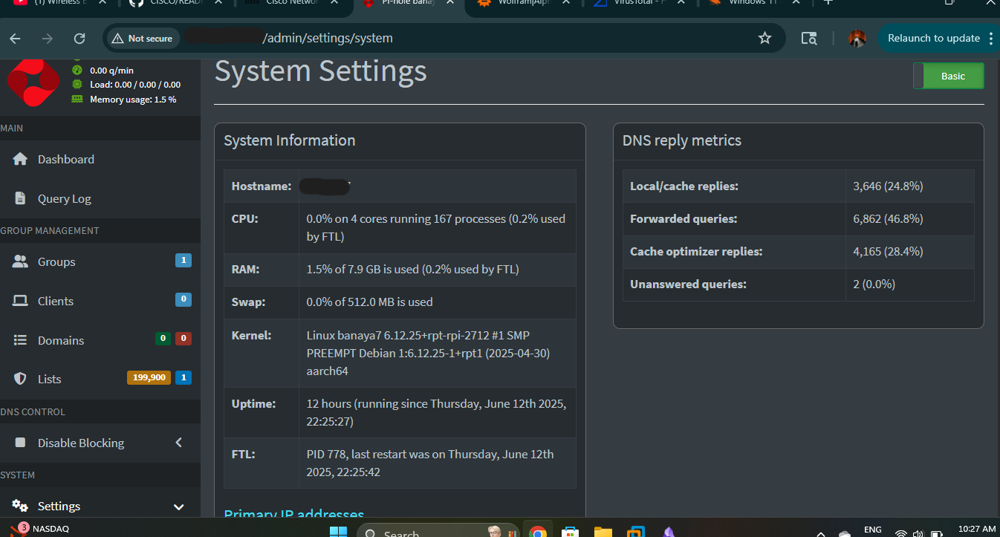

|  | This shows the dashboard of my self-hosted Pi-hole running on a Raspberry Pi. It acts as a local DNS server and blocks ads and trackers across my home network. So far, it has processed over 10,000 DNS queries, blocking around 15% using a blocklist of nearly 200,000 domains.This setup helps improve network performance and privacy by filtering out ads and trackers at the DNS level. |

|  | Here it shows DNS traffic on my Pi-hole over time, along with a breakdown of query types and upstream servers. It highlights how different DNS requests are handled, blocked, cached, or forwarded to Quad9 for resolution. This helps monitor and manage network activity efficiently.                                                                                                        |
|  | This is a Pi-hole system settings dashboard. It shows low CPU and RAM usage with no swap being used. The system runs on a Debian-based Linux kernel for ARM architecture and has been up for 12 hours. DNS reply metrics indicate that most queries are forwarded, followed by cache optimizer replies and local cache replies, with very few unanswered queries.                              |
